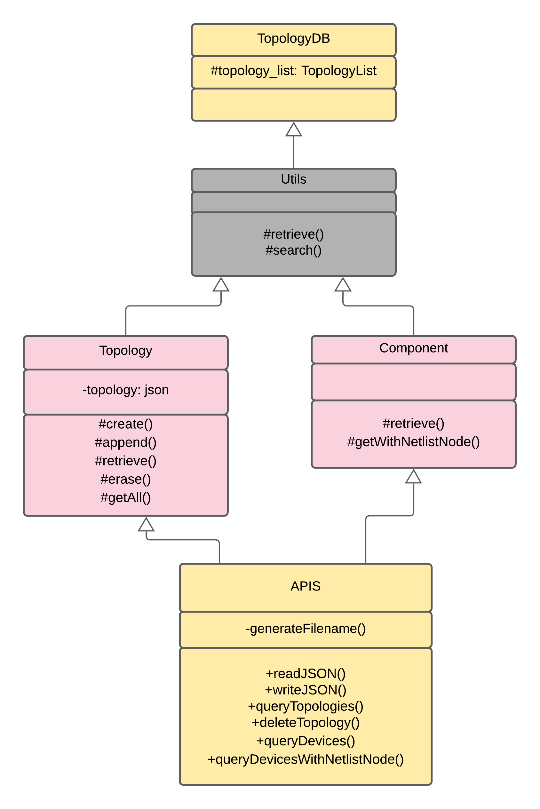

# Topology-APIs
Provide the functionality to access, manage and store device topologies

# Prerequisites
* g++ compiler
* [nlohmann json library](https://github.com/nlohmann/json)

# Tools
* Build system: g++
* Static code analysis: [cpp checker](http://cppcheck.net/)

# Design

